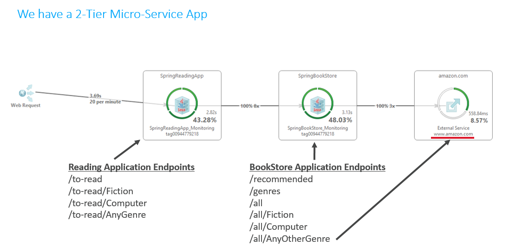
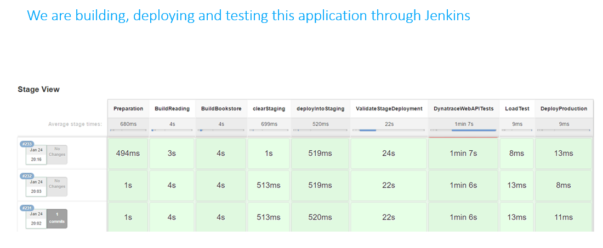
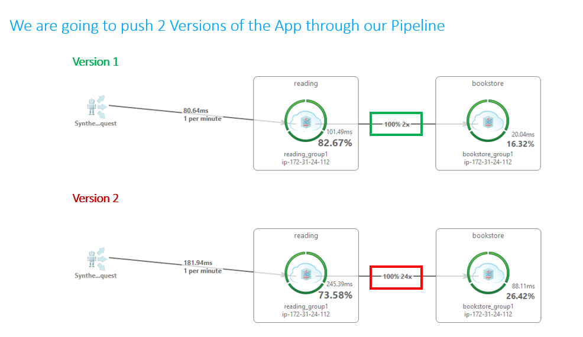
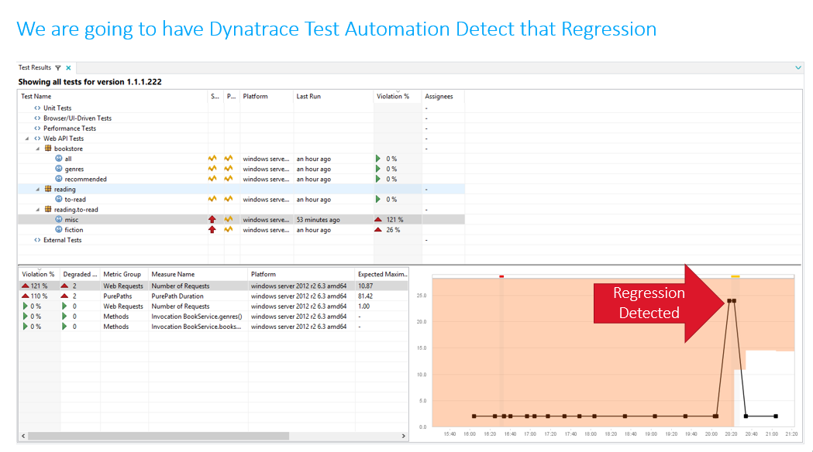
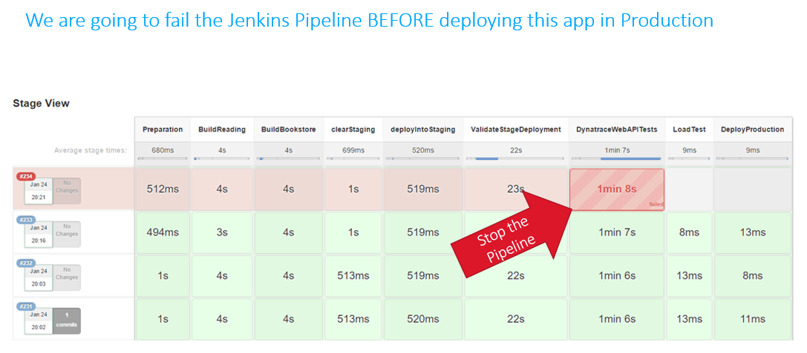

# SpringBootBookstoreWithProblems
This is an extended version of the Spring Boot Sample App I found here: https://spring.io/guides/gs/circuit-breaker/

## Overview of new version of this app

## Dynatrace PERFORM 2017 HOT DAY
We are going to use this app for our [Dynatrace Perform 2017](http://perform.dynatrace.com) Hands on Training Day in our session "Shift-Left Performance: Integrating Dynatrace in your Pipeline".
In that training session  we are going to build a Jenkins Build Pipeline to build and deploy this 2 tier Spring Boot App. 
We will also execute a handful of HTTP Web API Tests against the REST APIs. The [Dynatrace AppMon Jenkins Integration](https://wiki.jenkins-ci.org/display/JENKINS/Dynatrace+Plugin) and [Dynatrace Test Automation](https://community.dynatrace.com/community/display/DOCDT65/Test+Automation+Explained) feature allow us to stop the pipeline in case a code change to the app is going to impact performance, scalability or if it introduces any architectural rules

Here is a quick overview of what we are trying to achieve in that training session:

**Building a Jenkins Pipeline for this App**

**Switching from Version 1 to Version 2 of this App**

**Dynatrace automatically detects the regression**

**Dynatrace Jenkins Plugin stops the pipeline**

# Want to learn more about Dynatrace AppMon and Shift-Left Performance?
Get your Dynatrace AppMon & UEM Personal License: http://bit.ly/dtpersonal
Watch my YouTube Tutorials on that topic
* [Shift-Left Performance with Selenium, SauceLabs and Dynatrace in Jenkins and Bamboo](https://www.youtube.com/watch?v=-OSSKwD4WKQ&list=PLqt2rd0eew1bmDn54E2_M2uvbhm_WxY_6&index=50&t=2s)
* [Building a Metrics-Driven Continous Delivery Pipeline with Dynatrace AppMon](https://www.youtube.com/watch?v=TXPSDpy7unw&list=PLqt2rd0eew1bmDn54E2_M2uvbhm_WxY_6&index=38&t=3s)
* [Scaling AWS CodePipeline with Dynatrace](https://www.youtube.com/watch?v=tb4xJ5im8jw&list=PLqt2rd0eew1bmDn54E2_M2uvbhm_WxY_6&index=61&t=2s)
* [Dynatrace Integration with Eclipse and Jenkins](https://www.youtube.com/watch?v=p4Vh6BWlPjg&list=PLqt2rd0eew1bmDn54E2_M2uvbhm_WxY_6&index=42&t=77s)
* [
